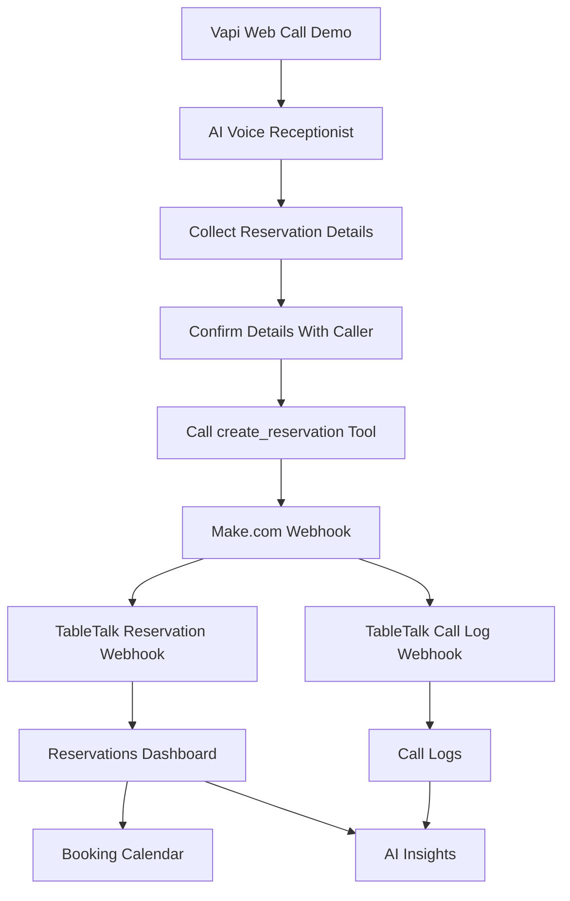
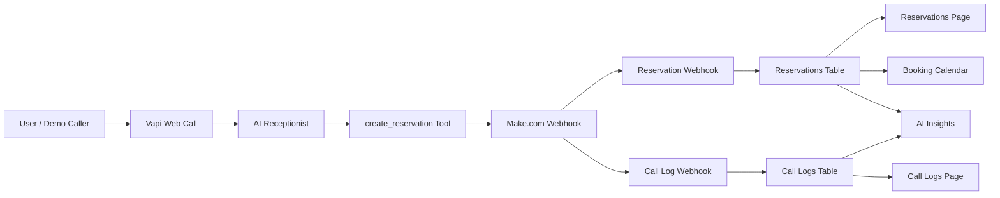

# TableTalk AI — AI Voice Receptionist SaaS MVP

TableTalk AI is an AI-first SaaS MVP for restaurant reservation automation. It demonstrates how a voice AI assistant can collect reservation details, trigger backend automation, and update a live SaaS dashboard with reservations, call logs, booking calendar data, and AI-powered business insights.

The project connects **Vapi**, **Make.com**, **Lovable**, secure webhooks, and a modern SaaS dashboard into one end-to-end AI workflow.

This MVP uses **Vapi Web Call Demo Mode** instead of a paid phone number. The architecture is phone-ready, meaning a real inbound phone number can be connected later through Vapi or Twilio for production.

---

## Overview

TableTalk AI is a restaurant-focused AI voice receptionist SaaS MVP.

The goal of this project is to show how AI agents can move beyond basic chatbots and connect directly into real business operations.

The system allows an AI voice assistant to:

- Speak with a customer
- Collect reservation details
- Confirm those details
- Trigger a structured tool call
- Send the booking to Make.com
- Create a reservation inside the SaaS dashboard
- Create a call log
- Update an internal booking calendar
- Update AI-powered business insights

This project is built as a practical AI implementation, not just a UI concept.

---

## Problem

Restaurants often miss customer calls when:

- Staff are busy during rush hours
- The restaurant is closed
- Employees are helping in-person customers
- The phone line is unavailable
- Staff do not have time to answer repetitive questions
- Reservation details are not captured in a structured system

Missed calls can lead to:

- Lost reservations
- Lost revenue
- Poor customer experience
- Staff interruptions
- No centralized record of customer inquiries
- No visibility into AI-handled customer interactions

---

## Solution

TableTalk AI acts as an AI receptionist for restaurants.

The AI assistant can:

- Greet callers
- Answer basic restaurant questions
- Collect reservation details
- Confirm booking information
- Trigger automation through Make.com
- Create reservations in the dashboard
- Create call logs automatically
- Update the booking calendar
- Update AI insights and operational metrics

For this MVP, the voice workflow is tested through **Vapi Web Call Demo Mode** to avoid paid phone-number setup.

A production version can connect the same assistant to a real inbound number through Vapi or Twilio.

---

## Live Demo

**Deployed App:**  
[https://tabletalk-ai-foundation.lovable.app]

**Demo Mode:**  
This MVP uses Vapi Web Call testing instead of a paid phone number.

**Production Upgrade:**  
A real phone number can be connected later using Vapi or Twilio.

---

## Project Status

```txt
Status: MVP Complete
Mode: Vapi Web Call Demo Mode
Production Phone Number: Optional future upgrade
Core AI Workflow: Working
Auth/Profile System: Working
Dashboard: Working
Reservations: Working
Call Logs: Working
Booking Calendar: Working
AI Insights: Working
Case Study Page: Working
```

---

## Core Workflow

The main reservation workflow works like this:



### Step-by-step workflow

1. A user starts a Vapi Web Call.
2. The AI receptionist answers as the restaurant assistant.
3. The customer asks to book a table.
4. The AI collects:
   - Customer name
   - Phone number
   - Reservation date
   - Reservation time
   - Party size
   - Special request
5. The AI repeats and confirms the details.
6. After confirmation, the AI calls the `create_reservation` tool.
7. Vapi sends structured reservation data to Make.com.
8. Make.com sends the data to TableTalk AI through secure webhooks.
9. A reservation is created in the dashboard.
10. A call log is created.
11. The internal booking calendar updates.
12. AI Insights update automatically.

---

## Key Features

### 1. Modern SaaS Authentication

The app includes a professional authentication and user profile system.

Features:

- Sign up
- Login
- Forgot password page
- Reset password support
- Full name collection during signup
- User profile creation
- Avatar initials
- Avatar color
- Account settings page
- User dropdown menu
- Protected dashboard routes
- Existing user fallback profile creation

After login, users can see:

- Full name
- Email
- Avatar initials
- Account dropdown
- Account settings

---

### 2. SaaS Dashboard

The dashboard gives a high-level view of restaurant AI activity.

It includes:

- Total calls
- Reservations captured
- Estimated revenue captured
- Average call duration
- Human handoffs
- AI resolution rate
- Recent reservations
- Recent call logs
- Setup progress
- Links to Booking Calendar and AI Insights

---

### 3. Reservation Management

The Reservations page allows restaurant owners to manage customer bookings.

Features:

- View all reservations
- Search by customer name or phone
- Filter by status
- Filter by source
- Add manual reservation
- Edit reservation status
- Delete reservation
- Status badges
- Source badges
- Responsive table layout

Supported statuses:

```txt
pending
confirmed
cancelled
completed
```

Supported sources:

```txt
voice_ai
manual
website
```

---

### 4. AI-Generated Call Logs

The Call Logs page tracks AI-handled reservation interactions.

For this MVP, call logs are created from successful reservation workflows.

A call log includes:

- Caller phone
- Call intent
- Call outcome
- Summary
- Transcript-style details
- Duration
- Created date

Example call log:

```txt
Caller: 555-222-8899
Intent: reservation
Outcome: reservation_created
Summary: AI assistant created a reservation for Jordan Lee for 4 guests on 08-10-2026 at 7:00 PM.
```

---

### 5. Internal Booking Calendar

Instead of relying on Google Calendar, TableTalk AI includes a modern internal booking calendar.

This makes the product feel like a real SaaS operating system instead of just an integration demo.

Features:

- Today view
- Week view
- Month view
- List view
- Reservation cards
- Status badges
- Source badges
- Reservation detail modal
- Add reservation modal
- High-volume slot warning
- Formatted date/time/phone display

Example display:

```txt
Customer: Jordan Lee
Date: 08-10-2026
Time: 7:00 PM
Phone: 555-222-8899
Party Size: 4
Source: AI Voice
```

---

### 6. AI Insights

The AI Insights page turns reservation and call log data into business intelligence.

It includes:

- Total AI reservations
- Total calls logged
- Estimated revenue captured
- AI resolution rate
- Average party size
- Most popular reservation time
- Today’s AI brief
- Booking trends
- Peak time insights
- Customer request insights
- Call outcome insights
- Recommended actions
- AI Assistant Health Score

This makes the app feel like a modern AI operations dashboard.

---

### 7. Restaurant Settings

Restaurant owners can manage the information used by the AI assistant.

Settings include:

- Restaurant name
- Address
- Phone number
- Timezone
- Opening hours
- Cuisine type
- Maximum party size
- Parking information
- Outdoor seating policy
- Dietary options
- Reservation rules
- FAQ / knowledge base
- Escalation phone
- Escalation email

---

### 8. AI Agent Setup Page

The AI Agent Setup page helps configure and understand the AI receptionist workflow.

It includes:

- AI assistant status
- Vapi connection status
- Make.com webhook status
- Reservation webhook status
- Call log automation status
- Booking calendar status
- Generated AI prompt
- Tool schema preview
- Integration roadmap
- Demo mode explanation

---

### 9. Public Case Study Page

The app includes a public case study page explaining:

- The problem
- The solution
- The architecture
- The workflow
- The tech stack
- Demo mode vs production mode
- Business value
- Future improvements

---

## Tech Stack

| Layer | Tool |
|---|---|
| SaaS App / Frontend | Lovable |
| Backend / Database | Lovable Cloud / Supabase-style backend |
| Authentication | Lovable Cloud Auth |
| Voice AI Assistant | Vapi |
| Automation Layer | Make.com |
| Integration Layer | Webhooks |
| UI | React, TypeScript, Tailwind-style components |
| Voice Testing | Vapi Web Call Demo Mode |
| Data Storage | Restaurants, Reservations, Call Logs, User Profiles |

---

## Architecture



---

## Demo Mode vs Production Mode

| Mode | Description |
|---|---|
| Demo Mode | Uses Vapi Web Call testing. No paid phone number required. |
| Production Mode | A real inbound phone number can be connected through Vapi or Twilio. |

### Current MVP

```txt
Vapi Web Call
→ AI Receptionist
→ Make.com
→ TableTalk AI Dashboard
```

### Production Upgrade

```txt
Customer calls real phone number
→ Vapi answers automatically
→ AI receptionist handles reservation
→ Make.com automation runs
→ TableTalk AI dashboard updates
```

The backend workflow is already structured so a production phone number can be added later without rebuilding the core system.

---

## Main Pages

### Public Pages

| Route | Description |
|---|---|
| `/` | Landing page |
| `/case-study` | Public project case study |
| `/auth/login` | Login page |
| `/auth/signup` | Signup page |
| `/auth/forgot-password` | Forgot password page |
| `/auth/reset-password` | Reset password page |

### Protected Pages

| Route | Description |
|---|---|
| `/dashboard` | Main dashboard |
| `/ai-insights` | AI insights and analytics |
| `/booking-calendar` | Internal booking calendar |
| `/reservations` | Reservation management |
| `/call-logs` | AI-generated call logs |
| `/settings` | Restaurant settings |
| `/agent-setup` | AI agent setup and prompt |
| `/account` | User account settings |

---
---

## Vapi Voice Agent Setup

The Vapi assistant is configured as the AI receptionist for Bella’s Italian Kitchen.

### Assistant Name

```txt
Bella's Italian Kitchen AI Receptionist
```

### Assistant Role

The assistant is instructed to:

- Answer restaurant-related questions
- Collect reservation details
- Confirm details before booking
- Avoid collecting payment information
- Use the `create_reservation` tool after confirmation
- Send date in `MM-DD-YYYY` format
- Send time in `7:00 PM` format
- Keep responses short and natural for phone conversations

---

---

## AI Assistant Behavior

The AI receptionist is designed to behave like a practical business assistant.

It can:

- Greet callers
- Answer restaurant FAQs
- Ask clarifying questions
- Collect all required reservation details
- Confirm the details before booking
- Trigger the reservation tool
- Report success after the tool succeeds
- Avoid making up unknown information
- Avoid collecting credit card/payment details

---

### Example Conversation

```txt
Customer:
Hi, I want to book a table.

AI:
Sure, I can help with that. May I have your name?

Customer:
Jordan Lee.

AI:
Thank you. What phone number should I use for the reservation?

Customer:
555-222-8899.

AI:
What date and time would you like?

Customer:
August 10, 2026 at 7 PM.

AI:
How many people will be joining?

Customer:
Four.

AI:
Any special requests?

Customer:
Outdoor seating if available.

AI:
Just to confirm, I have a reservation for Jordan Lee, phone number 555-222-8899, for 4 people on August 10, 2026 at 7 PM, with outdoor seating if available. Is that correct?

Customer:
Yes.

AI:
Great, your reservation has been created successfully.
```

---

## Setup Instructions

This project was built using Lovable, Vapi, and Make.com.

Exact setup may vary depending on how the project is exported or deployed.

---

## Project Capabilities

TableTalk AI can currently:

- Authenticate users
- Create user profiles
- Display avatar initials
- Manage restaurant settings
- Generate AI assistant prompts
- Receive AI-created reservations
- Create AI call logs
- Display reservations in an internal calendar
- Generate business insights
- Track AI receptionist performance
- Show booking trends
- Estimate captured revenue
- Support Vapi Web Call Demo Mode
- Support production upgrade to a real phone number

---

## Limitations

This is an MVP, so some production features are intentionally not included.

Current limitations:

- No live paid phone number connected
- No SMS confirmation
- No payment processing
- No multi-restaurant billing system
- No POS integration
- No CRM integration
- No advanced transcript analytics
- No real production calendar sync
- No production-grade staff scheduling logic

---

## Future Improvements

Potential next steps:

- Connect real inbound phone number through Vapi or Twilio
- Add SMS reservation confirmations
- Add multi-restaurant onboarding
- Add Stripe billing
- Add team/member roles
- Add role-based access control
- Add advanced call transcript analytics
- Add CRM or POS integrations
- Add waitlist management
- Add no-show tracking
- Add customer reminder system
- Add production analytics
- Add restaurant-specific onboarding flows

---

## Business Value

TableTalk AI demonstrates how AI voice agents can solve real business workflow problems.

Potential value for restaurants:

- Reduce missed reservation calls
- Capture customer details automatically
- Reduce staff interruptions
- Organize booking data
- Track AI-handled interactions
- Understand booking trends
- Improve operational visibility
- Build a foundation for AI-powered restaurant operations

---

## What I Learned

While building this project, I learned how to:

- Design an AI-first SaaS workflow
- Build a modern SaaS dashboard
- Connect Vapi voice agents to backend tools
- Use Make.com as an automation layer
- Design secure webhooks
- Structure AI tool schemas
- Build user-friendly reservation management
- Create AI insights from operational data
- Scope an MVP without overbuilding
- Present Web Call Demo Mode as a no-cost production-ready prototype
- Build authentication and user profile systems
- Create a product-like experience around an AI agent workflow

---

Recommended security practices:

- Rotate webhook secrets before public sharing
- Use environment variables
- Do not expose service role keys in frontend code
- Do not commit `.env` files
- Keep Make.com webhook URLs private if possible
- Use Row Level Security for user-owned data
- Keep user data isolated by authenticated user and restaurant

---

## Recommended GitHub Metadata

### Repository Description

```txt
AI voice receptionist SaaS MVP for restaurant reservations using Vapi, Make.com, Lovable, webhooks, booking calendar, call logs, and AI insights.
```

### Suggested Topics

```txt
ai
voice-ai
vapi
makecom
lovable
saas
ai-agent
restaurant-tech
automation
webhooks
prompt-engineering
typescript
react
ai-automation
ai-product
```

---

## Author

Built by:

```txt
[Umang Vataliya]
```

Role focus:

```txt
AI Product Builder / AI Implementation / Prompt Engineering / AI Workflow Automation
```

---

## Final Summary

TableTalk AI is a complete AI voice receptionist SaaS MVP that connects a voice assistant to real business operations.

It demonstrates:

- AI voice interaction
- Structured tool calling
- Webhook automation
- SaaS dashboard design
- Reservation management
- Call logging
- Internal booking calendar
- AI-powered insights
- Modern authentication and user profiles

This project shows how AI agents can go beyond simple chatbots and become operational tools that help businesses automate real workflows.
